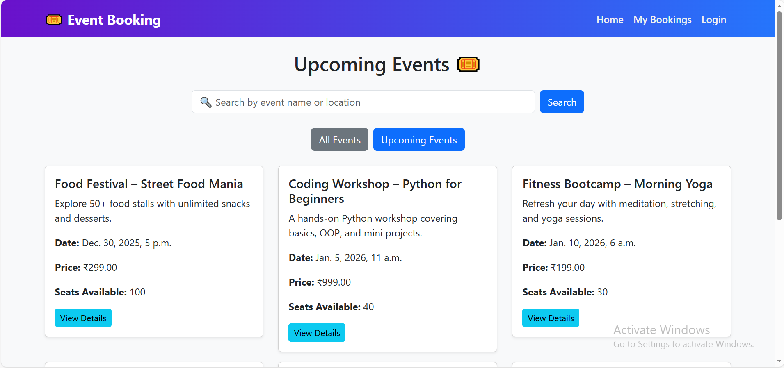
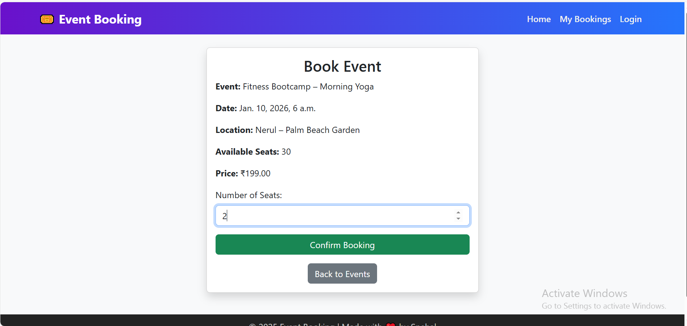
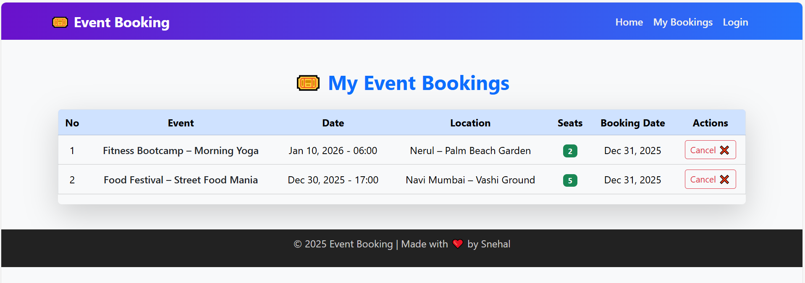

# 🎟️ Event Booking System (Django)

A web-based **Event Booking System** built using **Django** that allows users to explore upcoming events, view event details, book seats, manage their bookings, and cancel bookings.  
The project focuses on **real-world booking logic**, **clean UI**, and **user-friendly experience**.

---

## 🚀 Features

- User Authentication (Login required for booking)
- View Upcoming Events
- Event Detail Page
- Book Seats for Events
- Prevent Duplicate Bookings (One user → One event)
- View My Bookings
- Cancel Bookings
- Search Events
- Success / Warning messages (Auto dismiss)
- Clean & responsive UI using Bootstrap

---

## 🖼️ Screenshots

### 🏠 Home Page – Upcoming Events


### 📄 Event Detail Page


### 📋 My Bookings Page


> 📌 *Screenshots are added from the project UI.*

---

## 🛠️ Tech Stack

- **Backend:** Python, Django  
- **Frontend:** HTML, CSS, Bootstrap  
- **Database:** SQLite  
- **Version Control:** Git & GitHub  

---

## ⚙️ Installation & Setup

1. Clone the repository
```bash
git clone https://github.com/SNEHAL-2306/event-booking-system.git
